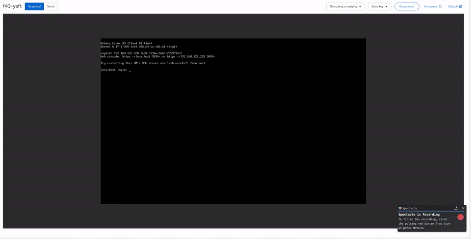

# yaft-drm



A DRM/KMS fork of [yaft](https://github.com/uobikiemukot/yaft) (yet another framebuffer terminal) that provides high-fidelity console terminal services on modern Linux kernels where the legacy `/dev/fb0` framebuffer device has been removed (`CONFIG_FB_DEVICE=n`).

## What This Is

Modern Linux distributions (Fedora 43+, RHEL 10+) have disabled the legacy framebuffer character device in favor of DRM/KMS. This breaks all framebuffer terminal emulators that depend on `/dev/fb0`, including the original yaft.

**yaft-drm** replaces the fbdev backend with DRM dumb buffers, enabling a full-featured terminal emulator on the bare Linux console with:

- **Sixel graphics** — render images and graphical applications like [brow6el](https://codeberg.org/janantos/brow6el) directly on the console
- **Mouse support** — evdev absolute for BMC/KVM hardware (iDRAC, iLO, Pi-KVM, QEMU, VMware), PS/2 relative fallback for physical mice
- **Adaptive cursor** — arrow cursor with save/restore (no ghost artifacts), auto-contrast based on background luminance
- **Nerd Font glyphs** — Terminus ASCII with 3469 Meslo Nerd Font icons for powerline, file type icons, and status indicators
- **True color approximation** — 24-bit RGB SGR sequences mapped to the nearest 256-color palette entry
- **Cursor blink** — ~1Hz block cursor blink on idle
- **Login shell support** — use as `/etc/shells` login shell with automatic fallback to bash over SSH
- **Configurable resolution** — `--res WxH`, `--res list`, or `~/.yaft-drm.conf`
- **Mouse mode selection** — `--mouse evdev|relative|auto` for different console environments
- **Command execution** — `-c "command"` to launch directly into an application
- **Clean tmux integration** — xterm SGR mouse reporting (modes 1000/1002/1006), proper DA handling, powerline rendering, mouse click support on tmux window tabs
- **Crash recovery** — signal handlers restore console on abnormal exit, clean CRTC restore with VT switch on normal exit

## Use Cases

### Terminal Web Browser on the Console

Run [brow6el](https://codeberg.org/janantos/brow6el) — a Chromium-based terminal web browser with Sixel graphics — directly on a server console with mouse interaction. No X11 or Wayland required.

```bash
yaft-drm -c "brow6el https://example.com"
```

### Headless Server Administration

Full terminal with mouse support, powerline-enabled tmux status bars, and graphical capabilities on headless servers accessed via iDRAC, iLO, IPMI, Pi-KVM, or VM console.

```bash
yaft-drm -c "tmux new -s Console"
```

### Login Shell

Use yaft-drm as a user's login shell. Console logins get a graphical framebuffer terminal; SSH sessions automatically fall back to bash.

```bash
sudo dnf install yaft
sudo example-shell-init.sh --yaft-login
sudo chsh username -s /usr/bin/yaft-drm
```

## Installation

### Fedora 43 / RHEL 10+ (COPR)

Pre-built RPMs are available from the [greg-at-redhat/brow6el](https://copr.fedorainfracloud.org/coprs/greg-at-redhat/brow6el/) COPR repository:

```bash
sudo dnf copr enable greg-at-redhat/brow6el
sudo dnf install yaft
```

This installs:
- `yaft-drm` — Terminus + Nerd Font icons, 8x16 cells (default)
- `yaft` — legacy fbdev version (for kernels with `/dev/fb0`)

The RPM also includes `example-shell-init.sh` at `/usr/share/doc/yaft/` and a man page (`man yaft-drm`).

### Build from Source

```bash
sudo dnf install gcc make ncurses libdrm-devel
make yaft-drm
sudo install -m755 yaft-drm /usr/local/bin/yaft-drm
```

## Usage

```bash
# Opens a shell on the DRM framebuffer
yaft-drm

# Set resolution
yaft-drm --res 1920x1080

# List supported resolutions
yaft-drm --res list

# Run a specific command
yaft-drm -c "brow6el https://example.com"

# Force mouse mode
yaft-drm --mouse evdev      # BMC/KVM absolute positioning
yaft-drm --mouse relative   # PS/2 relative
```

## Configuration

### Config files

| File | Purpose |
|------|---------|
| `/etc/yaft-drm.conf` | System-wide defaults |
| `~/.yaft-drm.conf` | Per-user overrides |

Command-line arguments override config file settings.

### Options

```ini
# Display resolution (must match a supported mode)
resolution=1920x1080

# Default command (instead of shell)
command=tmux new -s Console

# Mouse mode: auto, evdev, relative
mouse=auto

# Fallback to bash when not on a VT console
fallback=true
```

## Login Shell Setup

yaft-drm can be used as a login shell via `/etc/shells` and `chsh`. This is the recommended way to run yaft-drm on servers — console logins get the full graphical terminal, and SSH sessions fall back to bash transparently.

### Quick setup

```bash
sudo example-shell-init.sh --yaft-login
sudo chsh username -s /usr/bin/yaft-drm
```

The `--yaft-login` flag:
1. Adds `/usr/bin/yaft-drm` to `/etc/shells`
2. Creates `/etc/yaft-drm.conf` with `fallback=true`
3. Stops and disables gpm (conflicts with yaft-drm's built-in mouse)

### Prerequisites

The user must be in the `video` and `input` groups:

```bash
sudo usermod -aG video,input username
```

### Fallback mechanics

When `fallback=true` is set, yaft-drm checks whether it is running on a real VT console before attempting DRM initialization:

- **On a VT console** (physical hardware, iDRAC, Pi-KVM, VM console): yaft-drm takes over the display and provides a graphical framebuffer terminal with mouse, Sixel graphics, and Nerd Font rendering.
- **Over SSH, inside tmux, or in any non-VT context**: yaft-drm immediately execs `/bin/bash --login`. The user gets a normal bash login shell with no disruption.

This makes it safe to set yaft-drm as a login shell. SSH access, remote management, `scp`, `rsync`, and scripted logins all continue to work.

### tmux configuration

When yaft-drm is a user's login shell, tmux must use bash for its panes:

```
set -g default-shell /bin/bash
```

The `--tmux-global-config` flag in `example-shell-init.sh` includes this automatically.

### gpm

yaft-drm provides its own mouse input via evdev and PS/2 and conflicts with gpm. The `--yaft-login` flag automatically stops and disables gpm. Do not run gpm alongside yaft-drm.

### Reverting

```bash
sudo chsh username -s /bin/bash
```

No other cleanup needed.

## Mouse Support

yaft-drm auto-detects mouse input devices:

**Evdev absolute** — pixel-accurate cursor positioning via USB HID tablet devices. Used by BMC/KVM hardware:
- Dell iDRAC (Avocent USB)
- HPE iLO
- IPMI (AMI, ATEN)
- Pi-KVM (Raspberry Pi 4 Model B)
- QEMU USB Tablet
- VMware VMMouse

**PS/2 relative** — fallback using `/dev/input/mice` for physical mice and basic PS/2 emulation.

The cursor automatically adapts its color based on background luminance: white fill with black outline on dark backgrounds, black fill with white outline on light backgrounds. Pixels under the cursor are saved and restored on movement (no ghost artifacts).

Mouse click reporting (xterm SGR mode 1006) is activated when an application sends the standard enable sequences — tmux with `mouse on`, brow6el, and other xterm-compatible applications work automatically.

## Full Environment Setup

[example-shell-init.sh](https://github.com/gprocunier/calabi-shell) provides turnkey setup of the complete terminal environment:

```bash
# Install everything: calabi-shell prompt, tmux + Tokyo Night, git
sudo example-shell-init.sh

# Individual components
sudo example-shell-init.sh --calabi-shell
sudo example-shell-init.sh --tmux-global-config
sudo example-shell-init.sh --git
sudo example-shell-init.sh --yaft-login
```

See the [calabi-shell](https://github.com/gprocunier/calabi-shell) repository for full documentation.

## Tested Hardware

| Platform | Display Adapter | Mouse Input | Status |
|---|---|---|---|
| Dell PowerEdge (iDRAC 8) | Matrox G200eR2 | Avocent USB (evdev absolute) | Validated |
| Pi-KVM (Raspberry Pi 4 Model B) | USB HDMI capture | Pi-KVM HID (evdev absolute) | Validated |
| KVM/QEMU (Cockpit noVNC) | QXL / Virtio VGA | QEMU USB Tablet / VMware VMMouse (evdev absolute) | Validated |

### Performance (iDRAC 8, Matrox G200eR2, 1440x900)

| State | CPU Usage |
|---|---|
| Idle (shell prompt) | 0% |
| Cockpit /system page via brow6el | 19-21% |

### Performance (KVM/QEMU, QXL)

| State | CPU Usage |
|---|---|
| Idle (shell prompt) | 0% |

## Key Differences from Upstream yaft

- DRM/KMS backend (`/dev/dri/cardN`) instead of fbdev (`/dev/fb0`)
- Auto-detection of connected DRM display
- Login shell support with automatic SSH fallback
- Locale auto-detection (`C.UTF-8` fallback for Nerd Font rendering)
- evdev absolute mouse for BMC/KVM hardware (iDRAC, iLO, IPMI, Pi-KVM, QEMU, VMware)
- PS/2 relative mouse fallback
- Save/restore cursor with adaptive contrast (no XOR artifacts)
- xterm SGR mouse reporting (modes 1000/1002/1006) gated on application enable
- Cursor blink (~1Hz)
- True color SGR (`38;2;R;G;B`) to 256-color approximation
- DA response suppressed to prevent tmux escape leaks
- Crash signal handlers restore console state
- Clean exit with DRM CRTC restore and VT switch recovery
- `-c` command argument and config file support
- `--res WxH` / `--res list` resolution selection
- `--mouse evdev|relative|auto` input mode selection
- Terminus + Meslo Nerd Font icons for powerline rendering

## Requirements

- Linux kernel with DRM/KMS
- User in `video` and `input` groups
- A display connected to a DRM output (physical, virtual, or remote console)

## Upstream

Fork of [uobikiemukot/yaft](https://github.com/uobikiemukot/yaft) v0.2.9.

## License

MIT (same as upstream yaft)
